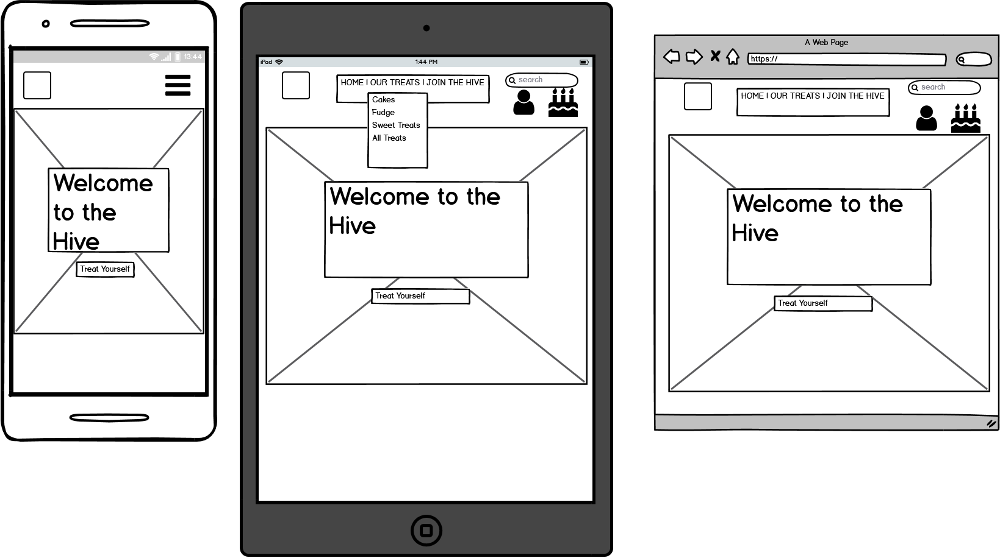
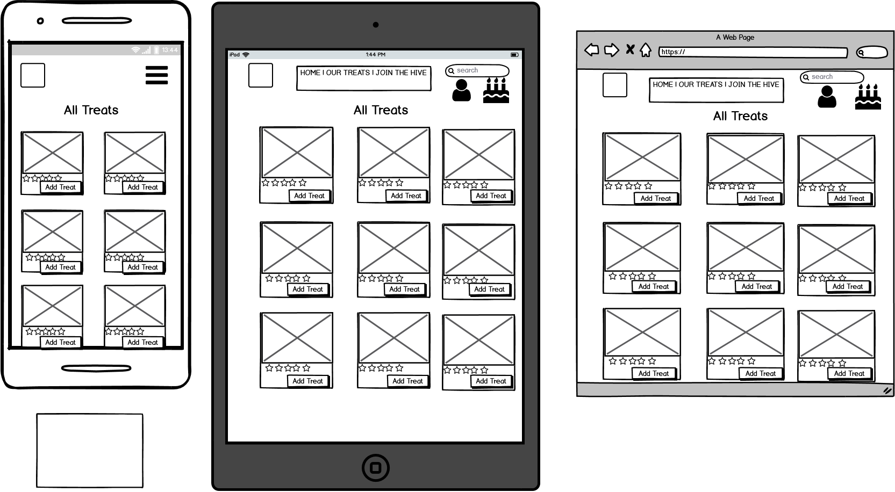
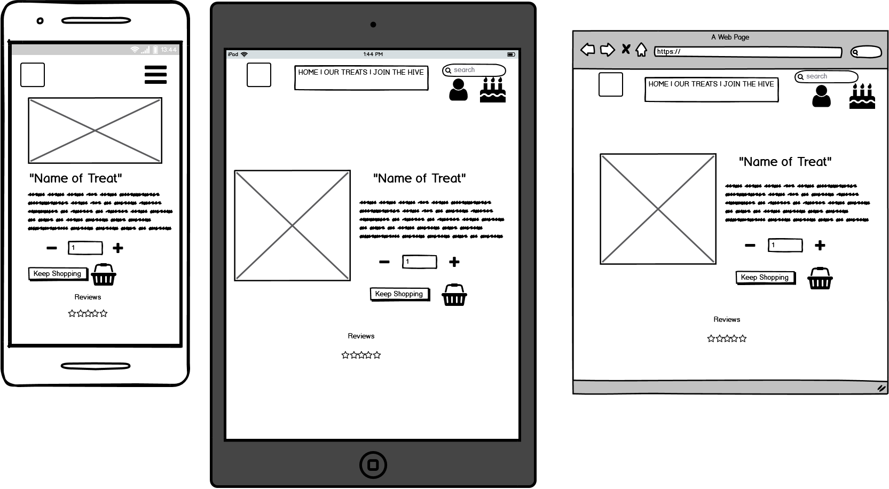
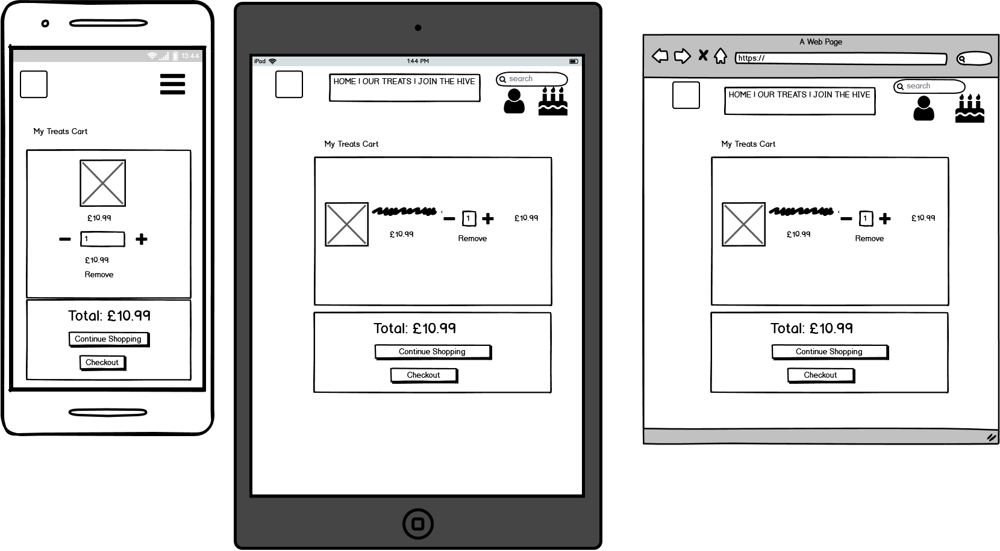
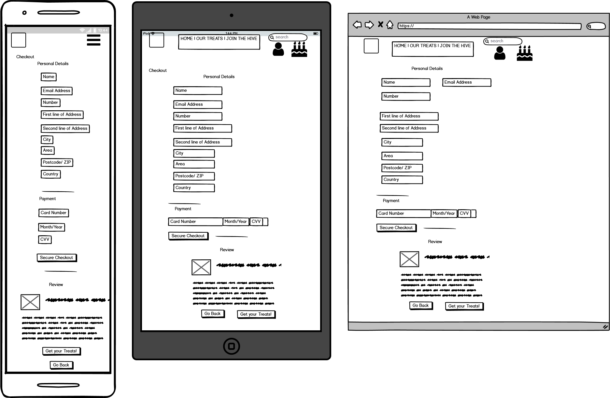
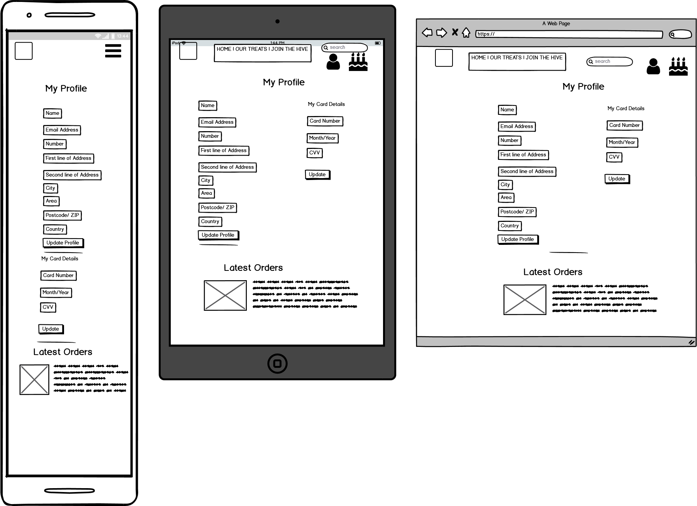
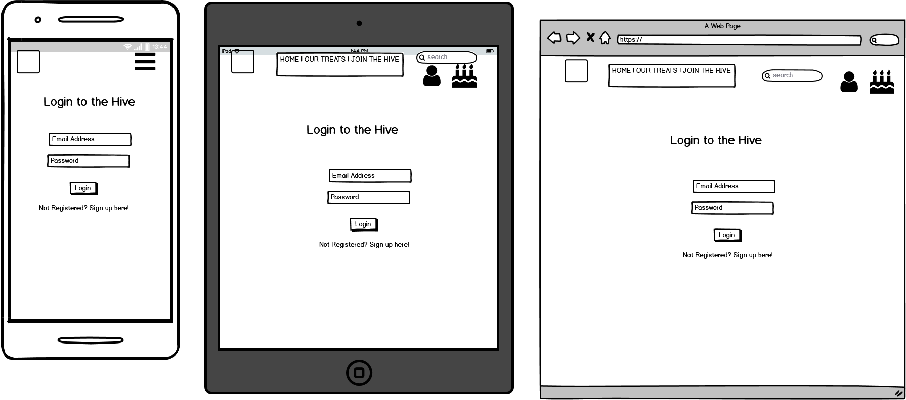
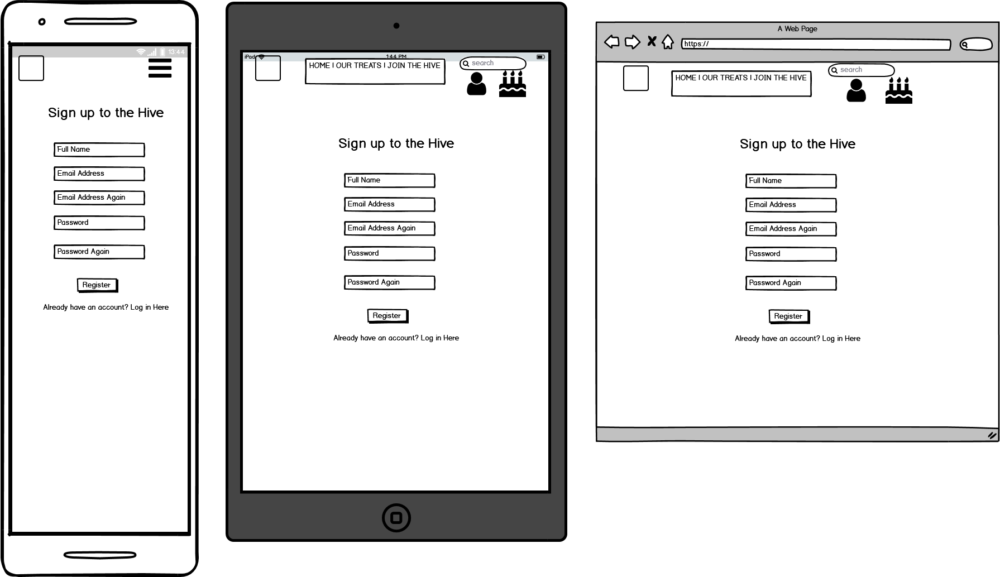
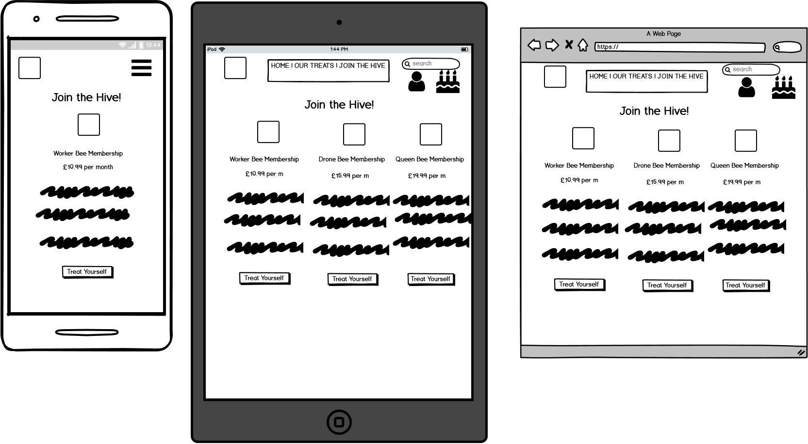

<a href="https://comb-confections.herokuapp.com/">Live Website</a>
<a href="https://github.com/jakefernihough/comb-confections>Github Repository</a>

# About

An e-commerce site bringing you all original sweet treat creations.

# Table of Contents

1. [User Experience](#user-experience)
    1. [Business Goals](#business-goals)
    1. [User Stories](#user-stories)
        1. [User](#user)
            - [Common User Stories](#common-user-stories)
            - [As a first time visitor](#as-a-first-time-visitor)
            - [As a casual/ regular shopper I want to](#As-a-casual/-regular-shopper-I-want-to)
            - [As an Admin I want to](#as-an-admin-I-want-to)
    1. [Scope](#scope)
    1. [Structure Plane](#structure-plane)
        1. [Sign Up (Registration) and Login](#sign-up-(registration)-and-login)
        1. [Navigation](#navigation)
            - [Navbar](#navbar)
            - [Home Page](#home-page)
            - [Treats Page](#treats-page)
            - [Detailed Treats Page](#detailed-treats-page)
            - [Bag](#bag)
            - [Checkout Page](#checkout-page)
            - [Profile](#profile)
            - [Features Left to Implement](#features-left-to-implement)
    1. [Skeleton Plane](#skeleton=plane)
        - [Wireframes](#wireframes)
    1. [Surface Plane](#surface-plane)
    1. [Features](#features)
        1. [Existing Features](#existing-features)
        1. [Future Features](#future-features)
1. [Information Architecture](#information-architecture)
    - [Structure](#structure)
1. [Technologies Used](#technologies-used)
    - [Languages Used](#languages-used)
    - [Frameworks and Programs Used](#frameworks-and-programs-used)
1. [Deployment](#deployment)
    1. [Local Deployment](#local-deployment)
    2. [Heroku Deployment](#heroku-deployment)
    3. [Hosting Files with AWS](#hosting-files-with-aws)
    4. [Sending Emails through Gmail](#sending-emails-through-gmail)
1. [Credits](#credits)
    1. [Code](#code)
    1. [Content and Media](#content-and-media)
    1. [Acknowledgements](#acknowledgements)    
1. [Final Say](#final-say)

# User Experience

## Business Goals

- Connect the business to social media to feed in a larger audience
- Outperform competitors by providing excellent services, products and support.
- Update the products with new and exciting recipes.
- Earn a profit by allowing anyone to purchase products

## User Stories

### User

#### Common User Stories

i. I want to easily navigate the site so that I can find what I'm looking for.

ii. I want to be able to contact the company if I'm experiencing an issue.

iii. I want the website to be readable on all screen sizes.

[Back to Menu](#table-of-contents)

#### As a first time visitor

i. Understand what the website provides and whether I want to invest my
time.

ii. View and compare the memberships so that I can decide is any suits me
before I subscribe.

iii. Understand the benefits of becoming a member.

iv. Easily find how to register/ subscribe to the site without it being too
difficult to find.

v. Be able to quickly register and start using the site so that I can have my
account and receive the benefits.

[Back to Menu](#table-of-contents)

#### As a casual/ regular shopper I want to

i. Navigate to the product page to find what I want easily.

ii. Filter products by category to find products faster.

iii. Sort by price/ name to find products faster.

iv. See the price before I add it to my bag.

v. Have a quick way of adding to the bag without having to go through extra steps.

vi. Be able to see more details about the product before I submit to buying.

vii. Search for an item anywhere on the site.

viii. Select and edit the quantity of how many of the product I want to buy.

ix. See my shopping cart before checkout so I can process any changes.

x. See all charges before purchase so that I can review my orders and if it is
suitable for my price range.

xi. Add my details without too many steps, so I don’t get discouraged with a
lengthy checkout system.

xii. Secure my payment information so that I feel safe with using my card
details.

xiii. See an order confirmation and receive an email so I have proof of
purchase.

[Back to Menu](#table-of-contents)

#### As a member
i. Register an account easily.

ii. Log in and out quickly and easily.

iii. See my personal details so I can manage them at any time.

iv. See my membership details and what my benefits include.

v. Change the membership when I want so I have more control over my
expenditure.

vi. Cancel my paid membership without any hassle.

vii. See my order history so I can have the confirmation details in one place.

viii. Receive benefits as a member.

ix. See the estimated delivery date for my order.

[Back to Menu](#table-of-contents)

#### As an Admin I want to

i. Be able to add an item so I can update the products on the site.

ii. Be able to edit and remove items so that I can customise items on the site
and offer new deals/ products to the consumers.

iii. Add/ Edit new memberships so that I can customize prices and benefits.

iv. Have oversight of user data so that I can help with any issues/ queries.

[Back to Menu](#table-of-contents)

# SCOPE

- Comb Confections is an e-commerce site.
- User
    - It allows users to Register/ Login to an account.
    - Authorise payments for membership as well as single products.
    - Shows categorised Products and Product Page.
    - Has a Profile Page for members.
    - allows users to buy products and checkout securely.
- Admin
    - Edit and add new products with prices and descriptions.
    - Modify and delete profile accounts.
    - Check to make sure payments have gone through.

[Back to Menu](#table-of-contents)

# Structure Plane

- Navigation - Top Level
- Body - Main Page Elements
- Footer - Social media Icons on bottom

[Back to Menu](#table-of-contents)

## Sign Up (Registration) and Login
I have used a 3rd Party package called Allauth to take care of the logic. 
The users are asked to fill in the Registration with fields ‘Email’, ‘Username’, and password, 
this is done twice to make sure they are both the same.

Sign Up and Login. The form has two fields, ‘email’ and ‘Password’.
Full Page background with a center-block design.

[Back to Menu](#table-of-contents)

## Navigation
### Navbar

    - Left - Comb Confections logo
    - Center - Page Niavigation and Search bar.
    - Right - Checkout bag and Profile.

[Back to Menu](#table-of-contents)

## Home Page
I chose to have a bee-themed site to go with the Honeycomb business.
So a bee background, with the main colours resembling that of a beehive.
I had a WELCOME opening. Then a link to look at the treats we had to offer.
We also had a JOIN THE HIVE section where a user could then purchase a membership.

[Back to Menu](#table-of-contents)

## Treats Page
- You can select All Treats, or pick a particular category on the navbar.
- Use the Search bar if you're looking for anything particular.
- Select the category at the top of the page.
- The cards have a black background with white text.
- Sort the products into Alphabetical, Category, Rating and Price!
- Every item has a card with it's details on, including an image, price, rating and the name of the product!
- Clicking on the image will take you to the Details Treat page.
- *Admin* - Edit or delete product.

[Back to Menu](#table-of-contents)

## Detailed Treats Page
- Navbar just above.
- Black background, white text.
- Image to the left of the page.
- On the right side you have the name of the product.
- The Price of the item.
- Brief description of the product.
- Category of the Product.
- Rating of the Product.
- Quantity bar of how many the user would like to purchase.
- Keep Shopping button to take you back to Treats Page.
- Add to Bag, to add it to the bag.
- *Admin* - Edit|Delete treat button.

[Back to Menu](#table-of-contents)

## Bag

- Displays products info of what is in your bag.
- Displays image of product.
- Displays Price and Quantity of your products.
- Option to update/Delete items.
- Subtotal of that products overall price.
- Bag Total
- Delivery Price - If under the threshold.
- Grand Total Price of all the products in the bag.
- Message to let you know if the user is under/over free delivery threshold.
- Secure Checkout Button - Checkout Page.
- Keep Shopping button.

[Back to Menu](#table-of-contents)

## Checkout Page

- Order Summary. With Price, Sub Total, Grand Total.
- Details Forms.
- Name, Address, Contact Number. Option to save details to profile.
- Card Details to purchase items.
- Adjust Treats Bag.
- Complete Order.
- Final Price to declare what will be charged to your card.

[Back to Menu](#table-of-contents)

## Profile

- Stores Users Delivery Details.
- Stores Order History.
- Show's what Membership the user has. _- not used_

[Back to Menu](#table-of-contents)

## Features Left to Implement

- Fixing the Membership option.
- Review System.

[Back to Menu](#table-of-contents)

# Skeleton Plane

- ### Wireframes

    - 

        
Home

        
    

    - 

        
All Treats

        
    

    - 

        
Treats Bio

        
    

    - 

        
Bag

        
    

    - 

        
Checkout

        
    

    - 

        
Profile

        
    

    - 

        
Login

        
    

    - 

        
All Treats

        
    

    * Unused 
        - 

        
Memberships

        
    

[Back to Menu](#table-of-contents)

# Surface Plane

## Colour Scheme
- The colours resembled that of a bee and a beehive around the project.
- Used basic colours of - #goldenrod, #fff, #000
    
## Font
- The font we used was 'Playfair Display'

## Imagery
- All imagery is owned by Comb Confections who was kind enough to let me create this project.

[Back to Menu](#table-of-contents)

# Features

## Existing Features

### All Pages
- **Header**
    - Always situated at the top of every page.
    - Logo positioned top left on big screens.
    - On all screens - Search bar, My Hive and Bag are located at the top with their respective icons.
    - On bigger screens - Page navigation located underneath search bar. On small screens - Collapsable Hamburger Menu.
- **Links**
    - All links have a hover effect when interacting with them.
- **Search bar**
    - On larger screens - Search bar expands and changes to black bg and gold text. On smaller - The icon pops up a search bar underneath the nav menu.
- **Messages and Bag Toasts**
    - Everytime a successful action has been performed (login, register, add to bag) a message will appear on the top right, whether successful or not.
    - When an item has been added to bag, a Toast will appear to give all the updated information currently in the customers bag.

[Back to Menu](#table-of-contents)

###  Specific Pages
- **Home Page**
    - A small welcome message telling the customer what is included on this website.
    - Call to action button to take the user to the treats section.

- **Treats Page**
    - Items displayed in a responsive grid layout to accomodate screen sizes.
    - Most important information displayed on cards. - Name, Image, Price, Rating.
    - Image brings user to the item description page with added details.
    - Page has a filter function at the top of the page to filter through certain Categorys.
    - Page also has a sort function to sort through specific fields.

- **Treats Details Page**
    - Back button to take the user back to the previous screen.
    - Rating displayed.
    - Description of the product.
    - Category it belongs to.
    - Quantity adder to update how many items you want to buy.
    - Add to Bag button.

- **Bag Page**
    - Displays summary of items with the subtotal of each product, delivery price and grand total.
    - Informs the user of how much until the Free Delivery Fresholg kicks in.
    - User can navigate back to treats page or checkout.

- **Checkout Page**
    - Order summary of all items in the bag with the subtotal, delivery and grand total.
    - Delivery Details are provided as a form using crispy forms.
    - User can save their details to their profile if they are signed in otherwise there is a link to signup/login.
    - User is provided with a secure way to enter their bank details.

- **Checkout Success**
    - Order Details are provided to the user as a confirmation on top of the e-mail that has been sent to them.

- **Profile Page**
    - A crispy forms form that displays to the user any details that the user has saved. They can be edited or added to this page.
    - Order History of what the user has bought through this site, with a link to view all of the details.

[Back to Menu](#table-of-contents)

## Future Features
- Rebuild and manage to get the Membership function working. Had to delete this app due to invalid time to get it working after many hiccups.
- Add a blog page to keep up to date with everything going on at Comb Confections.

[Back to Menu](#table-of-contents)

# Information Architecture

## Database
- The database used for this project was **[PostgresSQL](https://www.postgresql.org/)** for deployed project and [**SQLite**](https://www.sqlite.org/index.html**) in development.

## Structure 
- Models were used throughout 5 apps.
    - **Home App** - Displays the home page of the website.
    - **Checkout app** - Handles the checkout pages and the checkout view for item purchase, including payments.
        
        - Order Model - Holds information on each order. This is populated when user completes the checkout. The details entered in the checkout will populate this model as well as custom calculations for total amount and discount and delivery charge

                order_number = models.CharField(max_length=32, null=False, editable=False)
                user_profile = models.ForeignKey(UserProfile, on_delete=models.SET_NULL, null=True, blank=True, related_name='orders')
                full_name = models.CharField(max_length=50, null=False, blank=False)
                email = models.EmailField(max_length=254, null=False, blank=False)
                phone_number = models.CharField(max_length=20, null=False, blank=False)
                country = CountryField(blank_label='Country *', null=False, blank=False)
                postcode = models.CharField(max_length=20, null=True, blank=True)
                town_or_city = models.CharField(max_length=40, null=False, blank=False)
                street_address1 = models.CharField(max_length=80, null=False, blank=False)
                street_address2 = models.CharField(max_length=80, null=True, blank=True)
                county = models.CharField(max_length=80, null=True, blank=True)
                date = models.DateTimeField(auto_now_add=True)
                delivery_cost = models.DecimalField(max_digits=6, decimal_places=2, null=False, default=0)
                order_total = models.DecimalField(max_digits=10, decimal_places=2, null=False, default=0)
                grand_total = models.DecimalField(max_digits=10, decimal_places=2, null=False, default=0)
                original_bag = models.TextField(null=False, blank=False, default='')
                stripe_pid = models.CharField(max_length=254, null=False, blank=False, default='')

        - Order Line Item Model that captures each item added to the cart and are used for calucations in the Order Model

                order = models.ForeignKey(Order, null=False, blank=False, on_delete=models.CASCADE, related_name='lineitems')
                product = models.ForeignKey(Product, null=False, blank=False, on_delete=models.CASCADE)
                quantity = models.IntegerField(null=False, blank=False, default=0)
                lineitem_total = models.DecimalField(max_digits=6, decimal_places=2, null=False, blank=False, editable=False)

    - **Products App** - Handles Product Display and Individual Item Detail view
        
        - Category Model - Stores Item Categories

                name = models.CharField(max_length=254)
                friendly_name = models.CharField(max_length=254, null=True, blank=True)

        - Product Model - Stores Individual Item Information.

                product_number = models.CharField(max_length=254, null=True, blank=True)
                image = models.ImageField(null=True, blank=True)
                name = models.CharField(max_length=254)
                category = models.ForeignKey('Category', null=True, blank=True, on_delete=models.SET_NULL)
                description = models.TextField()
                rating = models.DecimalField(max_digits=6, decimal_places=2, null=True, blank=True)
                price = models.DecimalField(max_digits=6, decimal_places=2)
    
    - **Profiles App** - Handles Profile view and creating a profile whenever a user registers. It also handles Order History view.
        
        - UserProfile Model - Holds data on each user that can be edited at any time.

                user = models.OneToOneField(User, on_delete=models.CASCADE)
                default_phone_number = models.CharField(max_length=20, null=True, blank=True)
                default_street_address1 = models.CharField(max_length=80, null=True, blank=True)
                default_street_address2 = models.CharField(max_length=80, null=True, blank=True)
                default_town_or_city = models.CharField(max_length=40, null=True, blank=True)
                default_county = models.CharField(max_length=80, null=True, blank=True)
                default_postcode = models.CharField(max_length=20, null=True, blank=True)
                default_country = CountryField(blank_label='Country *', null=True, blank=True)

[Back to Menu](#table-of-contents)

# Technologies Used
## Languages Used

- [HTML5](https://en.wikipedia.org/wiki/HTML5)
- [CSS3](https://en.wikipedia.org/wiki/Cascading_Style_Sheets)
- [JavaScript](https://www.javascript.com/)
- [Python 3.8.5](https://www.python.org/)

[Back to Menu](#table-of-contents)
## Frameworks and Programs Used

- Front End
    - [Bootstrap](https://getbootstrap.com/) - Used for the responsive layout, as well as Navbar, Header, Forms and Item Cards.
    - [Font Awesome](https://fontawesome.com/) - Adding the Icons throughout the pages.
    - [Google Fonts](https://fonts.google.com/) - Imported the 'Playfair Display' Font.
    - [jQuery 3.5.1](https://jquery.com/) - Used in JavaScript logic.
- Back End 
    - [Django](https://www.djangoproject.com/)- Main Framework to build the project
    - [Stripe](https://stripe.com) - Used to make the single and subscription (if it worked) plans.
    - [Psycopg2](https://pypi.org/project/psycopg2/) - Used to allow postgresSQL to be used with python
    - [Django Crispy Forms](https://django-crispy-forms.readthedocs.io/en/latest/) - Used to display Forms
    - [Gunicorn](https://pypi.org/project/gunicorn/) - Deployment tool.
    - [Boto3](https://boto3.amazonaws.com/v1/documentation/api/latest/index.html)  - aid the deployment of AWS S3
    - [Pillow](https://pillow.readthedocs.io/en/stable/) - Image processing tool in Python.
    - [Whitenoise](http://whitenoise.evans.io/en/stable/) - aids static file management.
    - [pip3](https://pip.pypa.io/en/stable//) - install packages into python.
    - [SQlite3](https://www.sqlite.org/index.html) - used as a database in development.
    - [PostgreSQL](https://www.postgresql.org/) - used as a database in deployment.
    - [AWS S3](https://aws.amazon.com/) - USed to store images and static files on the deployed site.
    - General
        - [Git](https://git-scm.com/) - Allows tracking of any changes in the code.
        - [Github](https://github.com/) - Used to host the project files.
        - [Heroku](https://dashboard.heroku.com/apps) - A Cloud platform used to deploy the web application.
        - [PicResize(https://picresize.com/) - edit and resize images.
        - [Balsamiq](https://balsamiq.com/wireframes/desktop/#) - Used for Wireframes.

[Back to Menu](#table-of-contents)
# Testing

All testing was documented in [TESTING.md](https://github.com/jakefernihough/comb-confections/blob/main/TESTING.md) file

[Back to Menu](#table-of-contents)

# Deployment

Comb Confections was developed with Gitpod IDE. Git was used for version control and GitHub for hosting the project's repository. The project is hosted on Heroku while AWS S3 is hosting static files and images.

## Local Deployment

To run this project locally (on your IDE), make sure you:

* have an IDE of your choice ready (such as [Gitpod](#https://www.gitpod.io/))
* Have the following installed:
    - [Git](#https://git-scm.com/)
    - [Python3](#https://www.python.org/)
    - [pip3](#https://pip.pypa.io/en/stable/)

You will also need free accounts of the following services.
- [Gmail](#https://mail.google.com/)
- [Stripe](#https://stripe.com/)
- [AWS S3](#http://aws.amazon.com/)

Instructions:

1. Clone this repository

    - After installing the requirements mentioned earlier, clone the project by pasting the following command into the terminal:
        - git clone https://github.com/jakefernihough/comb-confections/
    - Alternatively, you can go to [Comb Confections](#https://github.com/jakefernihough/comb-confections/) repository. Click the Green 'Code' button and 'Download ZIP option in the dropdown menu to save the files on your machine, for more information please visit [Github's help pages](#https://docs.github.com/en/github/creating-cloning-and-archiving-repositories/cloning-a-repository)

2. Set up environment variables
    - create .env file in the root directory
    - add .env to .gitignore file in the root directory
    - add the following environment variables to .env:

                - import os
                - os.environ["DEVELOPMENT"] = "True"
                - os.environ["SECRET_KEY"] = "<Your Key>"
                - os.environ["STRIPE_PUBLIC_KEY"] = "<Your Key>"
                - os.environ["STRIPE_SECRET_KEY"] = "<Your Key>"
                - os.environ["STRIPE_WH_SECRET"] = "<Your Key>"

    - You can set thes variables on 'Settings' through Gitpod.
    - Click your profile icon in the top right corner in Gitpod.
    - Open Workspaces.
    - Again click your profile icon in the top right corner.
    - Click 'Settings' in the dropdown menu.
    - 'Add Variable' to add variables.

3. Install requirements from the requirements.txt file
        
        - pip3 install -r requirements.txt

4. Migrate the Models to create a database.
   
        - python3 manage.py makemigrations
        - python3 manage.py migrate

5. Load the fixtures in this exact order.
        
        - python3 manage.py loaddata categories
        - python3 manage.py loaddata products

6. Create a superuser with admin rights.

        - python3 manage.py createsuperuser
    enter email, username and password.

7. Run the web app.
        
        - python3 manage.py runserver

8. Log into django admin

        - after running the web app, add /admin at the end of the URL and log in with the superuser credentials from the previous step.

[Back to Menu](#table-of-contents)

## Heroku Deployment

1. Create a requirements.txt file
        - pip3 freeze > requirements.txt

2. Create a Procfile
  
        - Create a Procfile in the directory.
        - Add the following code: 
        - web: gunicorn comb_confections.wsgi:application

3. Push the code to Github
        - git add .
        - git commit -m "< your commit note >"
        - git push

4. Create a new app on Heroku
    * Click on 'New' > 'Create New App'
    * Give it a unique name
    * Set region closest to you

5. Set Heroku Postgres
    * Got to 'Resources Tab'
    * Search for 'Heroku Posgres'
    * Select the 'Hobby Dev' Free Plan

6. Set Config Variables in Heroku

    | Key | Value |
    --- | ---
    AWS_ACCESS_KEY_ID | `<your_aws_access__key>`
    AWS_SECRET_ACCESS_KEY | `<your_aws_secret_access_key>`
    DATABASE_URL | <your_postgres_database_URL>
    EMAIL_HOST_PASS | `<your_email_key>`
    EMAIL_HOST_USER | `<your_email>`
    SECRET_KEY | `<your_secret_key>`
    STRIPE_PUBLIC_KEY | `<your_stripe_public_key>`
    STRIPE_SECRET_KEY | `<your_stripe_secret_key>`
    STRIPE_WH_SECRET | `<your_stripe_webhook_key>`
    USE_AWS | `True`
    ALLOWED_HOSTS | `<your-heroku-app-url>`

7. Set up a new database

    - in settings.py

        - import dj_databse_url
    
    - comment out DATABASES (temporarily, do not commit/push this code to GitHub until instructed so)
    - add the code:
            
            - DATABASES = {
             'default': dj_database_url.parse("<your Postrgres database URL>")
            } 

8. Migrate the Models to Postgres
        
        - python3 manage.py makemigrations
        - python3 manage.py migrate

9. Load the fixtures in this exact order.
        
        - python3 manage.py loaddata categories
        - python3 manage.py loaddata products

10. Create a superuser with admin rights.

        - python3 manage.py createsuperuser
    enter email, username and password.

11. Correct the settings.py database from step 7.
    - uncomment the DATABASES
    - remove the code added in step 7.

12. Add the hostname of Heroku app to allowed EMAIL_HOST_USER
    - in settings.py as the code:
            - ALLOWED_HOSTS = ['<your Heroku app URL>', 'localhost]

13. Push to Github

        - git add .
        - git commit -m "< your commit note >"
        - git push

14. Set up automatic deployment to Heroku (optional)
    * in Heroku go to 'Deploy' > 'Deployment method' > 'Connect to GitHub'
    * search for your repository and click on it
    * go to 'Automatic Deployment' > click 'Enable Automatic Deploys'

15. Test Automatic Deployment
    * your code should be automatically deployed to Heroku after pushing your code

[Back to Menu](#table-of-contents)

## Hosting Files with AWS

To host static files and images with AWS, you will need to create an [AWS account](#http://aws.amazon.com/).

You will also have to create:
    
    * An AWS S3 Bucket
    * A Bucket Policy
    * A Group
    * An Access Policy
    * A User

[Learn how to do this here](#https://docs.aws.amazon.com/AmazonS3/latest/userguide/GetStartedWithS3.html)

[Connect Django to S3](#https://django-storages.readthedocs.io/en/latest/backends/amazon-S3.html)

## Sending Emails through Gmail

To send automatic e-mails with Django, you need a Gmail account.

* Go to the account settings
* Go to the 'Other Google Account Settings'
* Go to the 'Security' tab
* Turn on 2-step verification
* Go back to the 'Security' tab and click on 'App passwords'
* Select 'Mail' in the app dropdown
* Select 'Other' in the device dropdown
* Copy the 16-character password
* Go to Heroku and put it under EMAIL_HOST_PASS config variable
* Input the Gmail e-mail under the EMAIL_HOST_USER config var

[Back to Menu](#table-of-contents)

# Credits

## Code

- The project’s code was developed by following the Code Institute video lessons and based on the understanding of the course material, 
The code has been customized and enhanced to fit with the purpose of the project. In some places the logic is used and in others the code.
- Idea for the Membership page is thank to this Git Repository https://github.com/LigaMoon/Prickly , However this section has been deleted due to no time to correct it.

[Back to Menu](#table-of-contents)
## Content and media

All images and content are owned by Miles Billington from Comb Confections who allowed me to use his work
to produce this project.

[Back to Menu](#table-of-contents)
## Acknowledgements

I would like to say thanks to these people who have helped and guided me through this final project and throughout the course.

- Adegbenga Adeye my tutor. He has supported me all this year and pushed me constantly. Thank you!.
- Miles, Fraser, Lydia, Jess, Danny, Kyle. Also My parents and my aunt... My friends and family who let me use their work, were my testers and who supported me for this journey.
- To the Tutor Scott who sat with me for 4 days trying to figure out the membership payment. (Though unfortunately didn't come to fruition).

[Back to Menu](#table-of-contents)
# Final Say.

So this project has not been my favourite. Unfortunately, it wasn't the final project that I wanted to submit. I had many problems throughout the development
that caused it to not go as planned. I had the help of 8 tutors who were also stumped when trying to help me fix my goal.
Due to my new job, I had a massive time constraint, so all of the time I would have loved to make this into the best possible product,
I was unable to. I feel that this final product is a reflection of that.
I am happy with what I have achieved over the past year, helping me get into an awesome new career and bringing new skills to my life.
I know that I will continue to get better after I submit this project and this is just a small setback in a big future for myself.
This was a big challenge and just this time, I wasn't able to win. 

[Back to Menu](#table-of-contents)